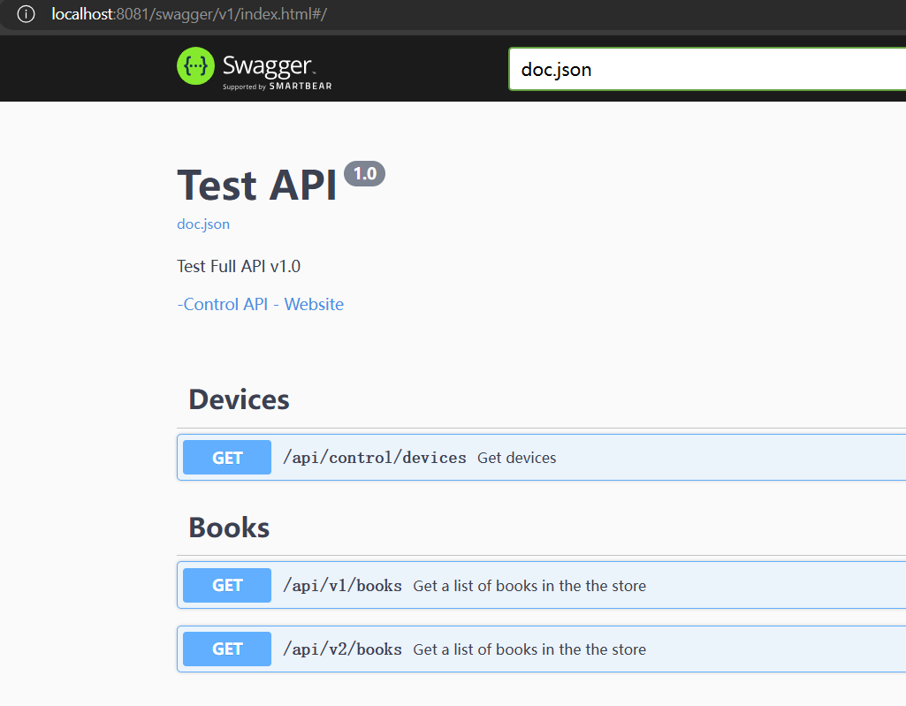
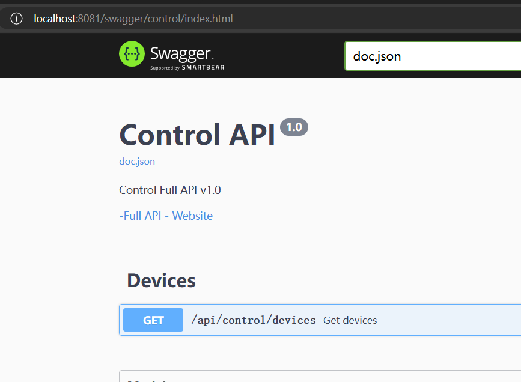

# gin-swagger-demo
简体中文 | [English](README-EN.md)

使用[gin-swagger](https://github.com/swaggo/gin-swagger)在一个项目中生成多个Swagger文档

go 版本 >= 1.16

## 需求和效果
gin项目有多个版本，例如v1 v2，或者有子项目时，如果只生成一个文档，会导致文档混乱不好阅读。所以我们为每个版本或子项目单独生成一个文档，并且通过不同路由来访问。





## 如何使用demo
下载demo
```
git clone https://github.com/lhl1115/gin-swagger-demo.git
cd gin-swagger-demo
go mod tidy
go run cmd/v1/main.go
or
go run cmd/control/main.go
or
go run --tags "doc" ./cmd/v2
```
访问浏览器查看Swagger文档
```
http://localhost:8081/swagger/v1/index.html
http://localhost:8081/swagger/v2/index.html
http://localhost:8081/swagger/control/index.html
```

生成Swagger文档
```
// 生成全部文档
swag init -g  cmd/v1/main.go  -o ./docs/swag  --instanceName v1


// 生成v2文档
swag init -g  ../../cmd/v2/main.go  -d internal/v2  -o ./docs/swag  --parseDependency --instanceName v2

// 生成control文档
swag init -g  ../../cmd/control/main.go  -d internal/control  -o ./docs/swag  --parseDependency --instanceName control
```

## 打包时忽略swag文档
在v2版本中我们给swag.go加上了 +build doc ，这样就可以在打包时按需忽略swag文档，减少打包后体积。
```
// 打包后体积约11M 无swag文档
go build -o v2.exe ./cmd/v2

// 打包后体积约26M 有swag文档
go build -o v2_doc.exe -tags "doc" ./cmd/v2
```